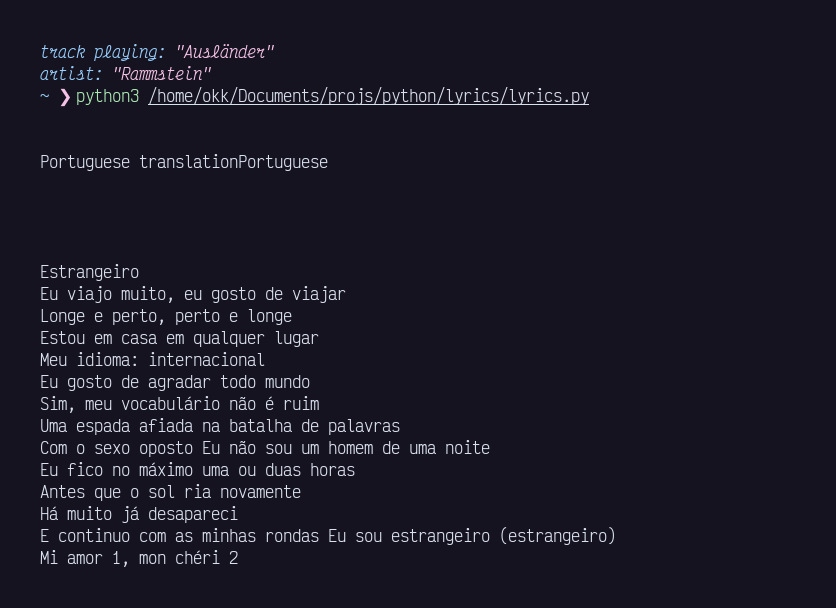

# lyricstranslate.py
use lyricstranslate to get lyrics translation

### usage
- run the script to get the lyrics translated, uses current spotify playing song
- it will translate the song to your local language

### dependencies:
- BeautifulSoup4 (pip3 install beautifulsoup4)
- selenium (pip3 install selenium)
- webdriver_manager (pip3 install webdriver_manager)
- dbus-python (pip3 install dbus-python)
- requests
